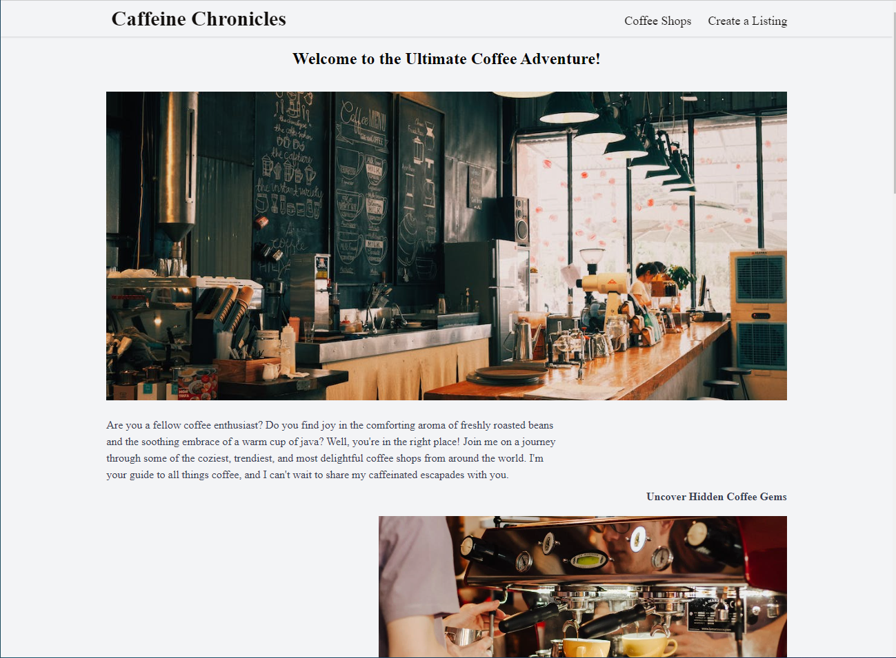
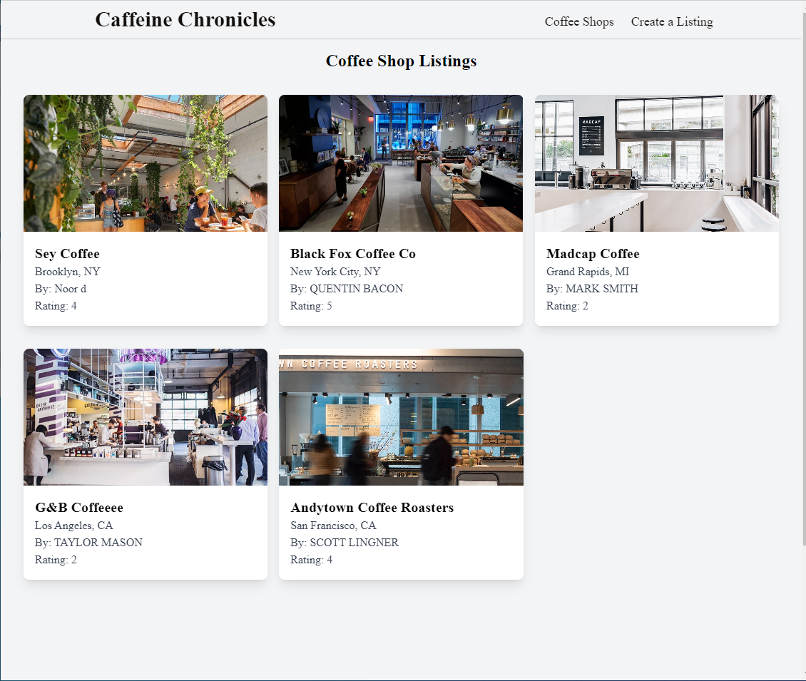
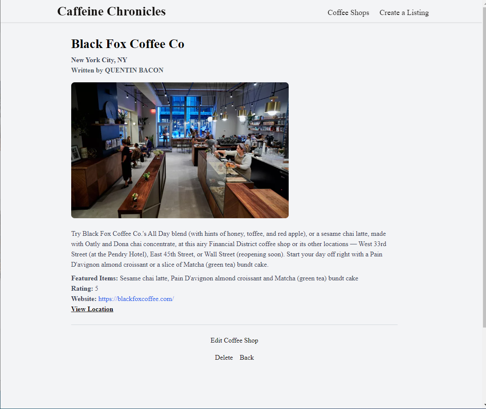
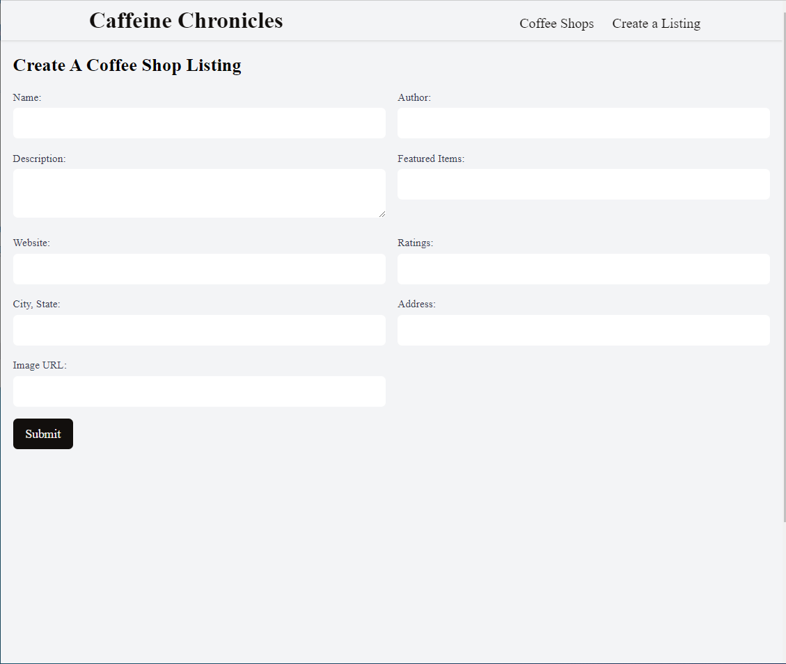

#  Caffeine Chronicles
Welcome to Caffeine Chronicles, your go-to coffee shop blog app designed to elevate your coffee experience in the heart of the city! Whether you're a coffee connoisseur or just seeking your daily caffeine fix, Caffeine Chronicles combines the power of MongoDB, React, Express, NodeJS, HTML, CSS, and Tailwind CSS to create a seamless and user-friendly platform for discovering, updating, and enjoying your favorite coffee shops in downtown.

   

# Key Features

- `Coffee Shop Discovery:` Caffeine Chronicles offers a curated selection of coffee shops, making it easy for coffee enthusiasts to explore new places and hidden gems. Discover the perfect spot to meet friends, study, or simply unwind.

- `Create and Update:` If you own or manage a coffee shop in downtown, Caffeine Chronicles allows you to create and update your shop's details effortlessly. Share your menu, update descriptions, and keep your location information up-to-date to ensure that customers can find you easily.

- `Location Information:` Caffeine Chronicles provides detailed location information, including maps and directions, to help users find their way to their chosen coffee shops. Never get lost in the downtown hustle and bustle again.

- `Responsive Design:` Our app boasts a responsive and user-friendly design built with React and enhanced with Tailwind CSS. Whether you're browsing on a desktop, tablet, or mobile device, Caffeine Chronicles looks and functions seamlessly.

## Technologies used
MongoDB, React, Express, NodeJS, HTML, CSS and tailwind

## App link  
https://coffee-shop-blog.vercel.app/ 

## Future Goals

Add user features

Add sorting functionality to sort by name/description and location

