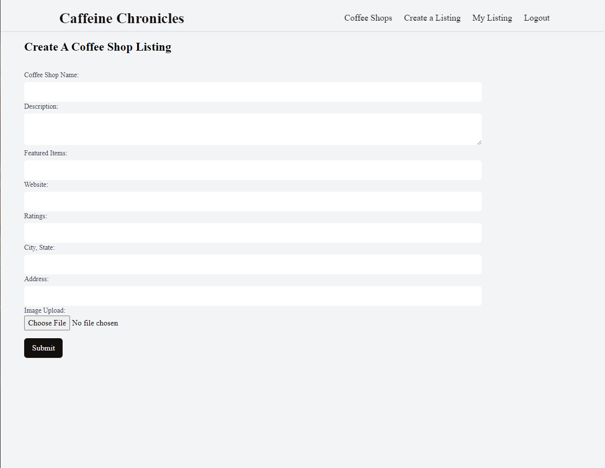

#  Caffeine Chronicles ☕📝
Welcome to Caffeine Chronicles, a web application that allows users to discover and review coffee shops. Caffeine Chronicles combines the power of MongoDB, React, Express, NodeJS, HTML, CSS, and Tailwind CSS to create a seamless and user-friendly platform for discovering, updating, and enjoying your favorite coffee shops in downtown.
 
 

# Key Features

- `Coffee Shop Discovery:` Caffeine Chronicles offers a curated selection of coffee shops, making it easy for coffee enthusiasts to explore new places and hidden gems. Discover the perfect spot to meet friends, study, or simply unwind.

- `Create and Update:` If you would like to write a blog or a review, Caffeine Chronicles allows you to create and update your post effortlessly. Share featured items, update descriptions, or your location to ensure that readers can find it easily.
- `User Authentication:` Securely register and log in to your account to access personalized features. Your profile and blog posts are now protected, ensuring your data is safe and only accessible to you.

- `Location Information:` Caffeine Chronicles provides detailed location information, including maps and directions, to help users find their way to their chosen coffee shops. Never get lost in the downtown hustle and bustle again.

- `Responsive Design:` Our app boasts a responsive and user-friendly design built with React and enhanced with Tailwind CSS. Whether you're browsing on a desktop, tablet, or mobile device, Caffeine Chronicles looks and functions seamlessly.

## Technologies used
MongoDB, React, Express, NodeJS, HTML, CSS and tailwind

## App link  
https://coffee-shop-blog.vercel.app/ 

test user: test@gmail.com 
, password:12345

With these new features, Caffeine Chronicles offers an even more immersive and personalized coffee shop discovery experience, along with the ability to create and share your own coffee adventures. Enjoy the world of coffee like never before

